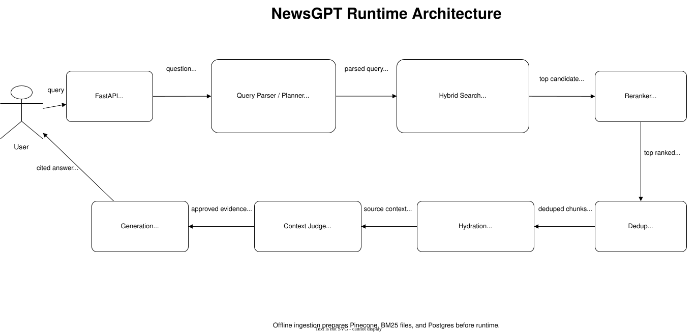

# NewsGPT

NewsGPT is a FastAPI-based RAG chatbot for searching and answering questions
from indexed news archives. It currently supports two sources:

- Sakal
- Bar & Bench

The app does not answer from model memory. It plans a search query, retrieves
relevant chunks from Pinecone, optionally reranks them, and generates a grounded
answer with citations from the retrieved sources.

## Architecture



The editable diagrams.net source is available at
`docs/newsgpt-architecture.drawio`.

## How It Works

1. The planner turns the user's question into a source-aware search query.
2. The retriever embeds the query for semantic search.
3. The BM25 encoder converts the query into sparse keyword values.
4. Pinecone runs hybrid search using both dense and sparse vectors.
5. The workflow checks whether the retrieved context is enough.
6. The answer step writes a source-grounded response with citations.

## Runtime Configuration

Copy `.env.example` to `.env` for local development and fill in real values.
Never commit real `.env` values.

Required core settings:

- `POSTGRESQL_URL`
- `PINECONE_API_KEY`
- `PINECONE_INDEX_HOST`
- `DEFAULT_NEWS_SOURCE`

Source-specific Pinecone and BM25 settings:

- `BARANDBENCH_PINECONE_INDEX_HOST`
- `BARANDBENCH_PINECONE_NAMESPACE`
- `BARANDBENCH_BM25_ENCODER_PATH`
- `SAKAL_PINECONE_INDEX_HOST`
- `SAKAL_PINECONE_NAMESPACE`
- `SAKAL_BM25_ENCODER_PATH`

OpenAI settings:

- `OPENAI_API_KEY`
- `OPENAI_CHAT_MODEL`
- `OPENAI_CONTEXT_JUDGE_MODEL`
- `OPENAI_EMBEDDING_MODEL`

Azure OpenAI can be used instead of direct OpenAI by setting:

- `AZURE_OPENAI_API_KEY`
- `AZURE_OPENAI_ENDPOINT`
- `AZURE_OPENAI_API_VERSION`
- `AZURE_OPENAI_EMBEDDING_API_VERSION`
- `AZURE_OPENAI_CHAT_API_VERSION`
- `AZURE_OPENAI_EMBEDDING_DEPLOYMENT`
- `AZURE_OPENAI_CHAT_DEPLOYMENT`
- `AZURE_OPENAI_PLANNER_DEPLOYMENT`
- `AZURE_OPENAI_CONTEXT_JUDGE_DEPLOYMENT`

Optional retrieval settings:

- `PINECONE_NAMESPACE` defaults to `default`
- `BARANDBENCH_BM25_ENCODER_PATH` defaults to `bm25_barandbench_values.json`
- `SAKAL_BM25_ENCODER_PATH` defaults to `bm25_sakal_values.json`
- `HYBRID_ALPHA` controls dense-vs-sparse search balance
- `RERANK_MODE=none` uses Pinecone scores only
- `RERANK_MODE=jina` enables Jina reranking when `JINA_API_KEY` is set
- `MAX_CONTEXT_JUDGE_CHARS_PER_SOURCE` caps source text sent to the fast context judge only

## Run Locally

Install dependencies:

```bash
uv sync
```

Start the API:

```bash
uv run uvicorn main:app --reload --host 0.0.0.0 --port 8000
```

Then open:

- API root: `http://localhost:8000`
- API docs: `http://localhost:8000/docs`
- Health check: `http://localhost:8000/health`

You can also run with Docker Compose:

```bash
docker compose up app
```

## Ingestion Scripts

Sakal:

- `convert_sakal_xml_to_json.py` converts Sakal XML files into `sakal.json`.
- `ingest_sakal.py` chunks Sakal articles, creates embeddings and BM25 values,
  and uploads vectors to Pinecone.

Bar & Bench:

- `ingest_barandbench.py` ingests Bar & Bench story dumps into Postgres and
  Pinecone.
- `backfill_barandbench_pinecone_published_at.py` backfills Bar & Bench
  Pinecone metadata for existing chunks.

Run ingestion through Docker Compose profiles when needed:

```bash
docker compose --profile ingest run ingest-sakal
docker compose --profile ingest run ingest-barandbench
```

## Tests

Run the unit test suite:

```bash
uv run python -m unittest discover -s tests
```
